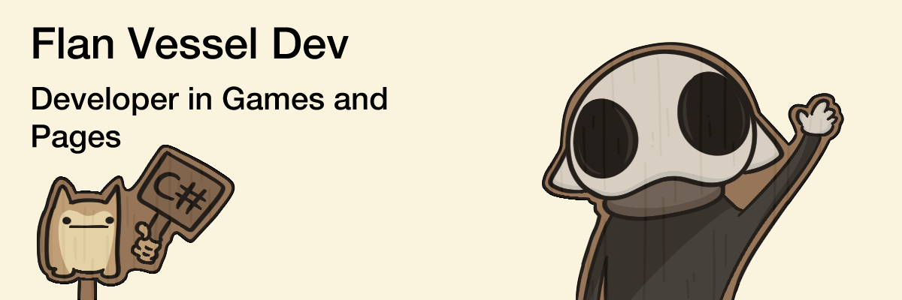

  

    <ul>
      <h1>Un poco sobre mi</h1>
      <li>Soy un estudiante que estudia programación en videojuegos como otros lenguajes.</li>
      <li>Programador de UNITY, Páginas Web y Diseñador novato.</li>
      <li>Dibujante en progreso.</li>
    </ul>
  

  

    
  

  

    <ul>
      <h1>Mis redes sociales:</h1>
      <li><a href="https://www.instagram.com/solitaryvessel?igsh=MTd0OHUzdTJ1ODQ5aQ%3D%3D&utm_source=qr" title="Pagina de IG">Instagram</a></li>
      <li><a href="https://flanvesseldev.itch.io/" title="Pagina de Itch.io">Itch.io</a></li>
    </ul>
  

  

    
  

